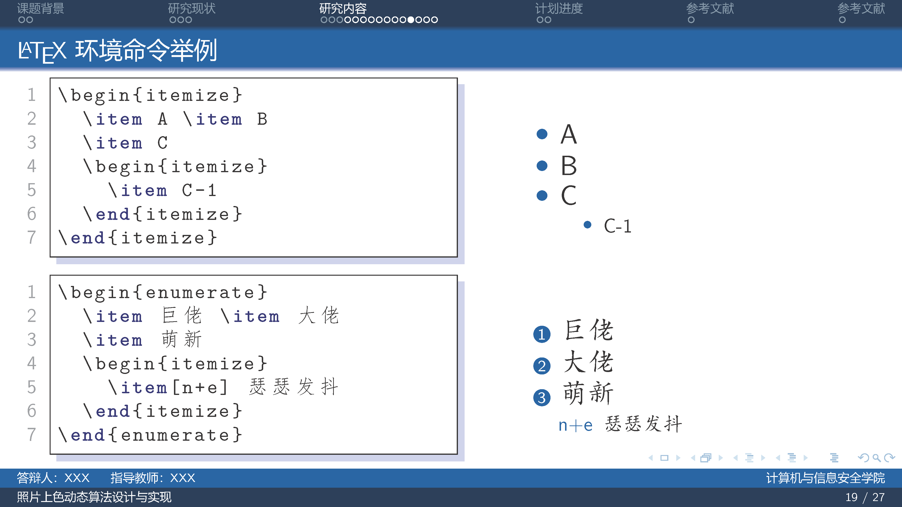
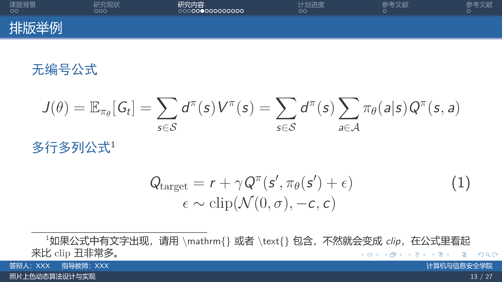
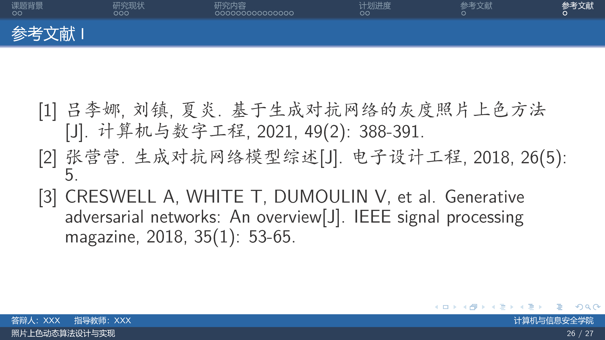

## 桂林电子科技大学PPT模板（beamer）

此项目提供用于排版桂林电子科技大学用于毕业答辩，组会报告等相关场景的Beamer模板，旨在帮助桂林电子科技大学师生高效地完成演示幻灯片的制作。


## 模板示例
<p align=center>

</p>

## 使用方法

### 本地部署写作

编译该模板请使用 XeLaTeX 引擎。

### Github Action 自动化集成

在仓库中提供CI/CD执行编译渲染PDF流程，你只要FORK这个仓库，然后本地编写或者直接通过github网页直接编写后push到你的github仓库，即可自动渲染,以下是ACTION配置代码：
```yml
name: Build LaTeX document
on:
    push:
      branches: [ main ]
jobs:
  build_latex:
    runs-on: ubuntu-latest
    steps:
      - name: Set up Git repository
        uses: actions/checkout@v3
      
      - name: 编译幻灯片Latex
        uses: xu-cheng/latex-action@v3
        with:
          root_file: slide.tex
          latexmk_use_xelatex: true

      - name: 上传幻灯片PDF
        uses: actions/upload-artifact@v4
        with:
          name: 幻灯片pdf
          path: ./slide.pdf       
```
下载渲染后的PDF是在这个位置：

